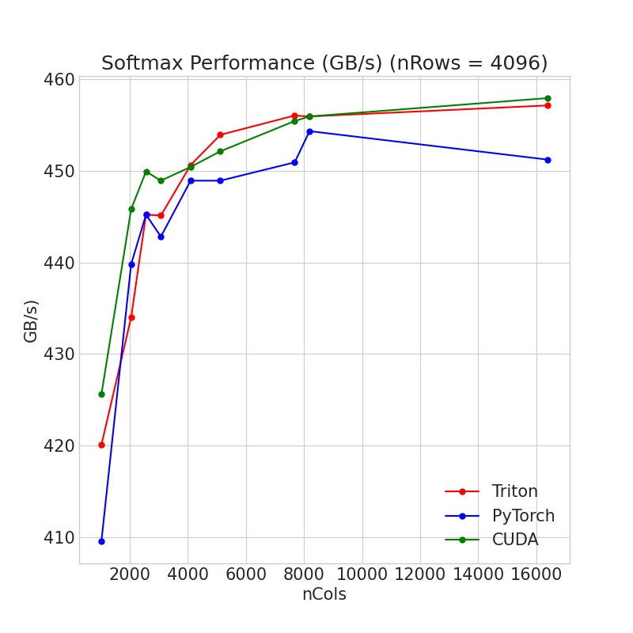

# CUDA Softmax

PyTorch extension of fused softmax in CUDA, performs on-par with the Triton Fused Softmax. Just getting experience writing CUDA reduction kernels and linking them against PyTorch.

## CUDA PyTorch Build Instructions

```bash
python3 setup.py install
```

## Example Use:

```python
import torch
from softmax_cuda import fusedSoftmax

# create random f32 tensor -> only single precision and 2D tensors are supported!
x = torch.randn((6144, 8192), device = 'cuda:0', dtype = torch.float32)
out = fusedSoftmax(x)
```

## CUDA C++ Standalone

You can also build the standalone CUDA kernel with [^1]:
```bash
make gpu
```
This script performs benchmarking and tests for correctness against an (unoptimized) CPU implementation.

Once compiled, run with:
```bash
./softmax_cuda.bin 
```

expected output should be similar to:
```bash
Warmup started
Benchmark started
Total elapsed time: (1.185808) s, performance: (  452.7) GB/s, memory reads & writes (GB): ( 536.9) 

Error checking:
Relative Error (0.00000190)
```


## Benchmarks

Comparison against `torch.softmax` and Triton's [Fused Softmax](https://triton-lang.org/main/getting-started/tutorials/02-fused-softmax.html#sphx-glr-getting-started-tutorials-02-fused-softmax-py)[^2]:



## Tests

```bash
pytest src/test_softmax.py
```

[^1]: Tested on an SM 8.9 GPU with nvcc 12.0
[^2]: Benchmark performed on RTX 4070 (Peak mem. BW is 504 GB/s)